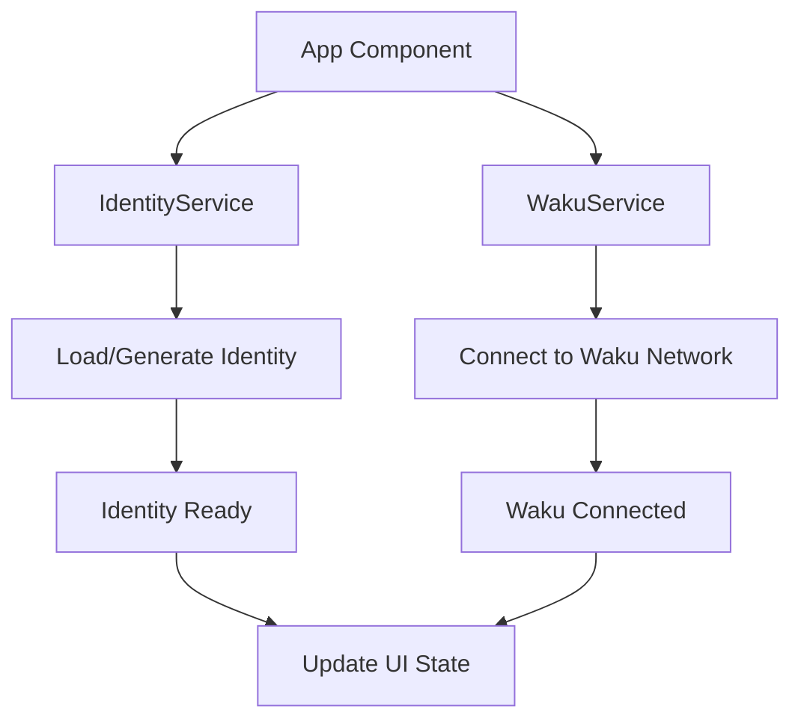

# Phase 2: Waku Integration Foundation - Complete Implementation Guide

## 📋 Overview

Phase 2 establishes the fundamental foundation for the DecenVote application by implementing:
- **WakuService**: Light Node connection and management
- **IdentityService**: Cryptographic system for anonymous identities
- **App Component**: Integration and basic UI

This phase prepares the necessary infrastructure for messaging protocols (Phase 3) and voting functionality (Phases 4-5).

---

## 🏗️ Implemented Waku Architecture

### Decentralized P2P Network
```
[Your Light Node] ←→ [Full Node] ←→ [Other Light Nodes]
      ↕                ↕              ↕
[Waku Protocols]   [History]    [P2P Exchange]
```

**Key Components:**
- **Light Node**: Lightweight client that doesn't store complete history
- **Full Node**: Complete node that maintains historical messages
- **Protocols**: Light Push, Filter, Store for different functionalities

---

## 🔧 WakuService - Network Connection

### File: `src/services/WakuService.ts`

#### Main Structure

```typescript
export class WakuService {
  private node: any = null;
  private isInitialized = false;
  private status: WakuStatus = {
    connected: false,
    peerCount: 0,
    syncComplete: false,
    error: null
  };
}
```

#### Predefined Content Topics

```typescript
public static readonly CONTENT_TOPICS = {
  POLLS: "/decenvote/1/polls/proto",
  VOTES: "/decenvote/1/votes/proto"
} as const;
```

**Why these topics?**
- `/decenvote/1/polls/proto`: Channel for poll creation messages
- `/decenvote/1/votes/proto`: Channel for vote submission messages
- Structure: `/{app-name}/{version}/{message-type}/{encoding}`

#### Light Node Initialization

```typescript
async initialize(): Promise<any> {
  // 1. Create Light Node with automatic bootstrap
  this.node = await createLightNode({
    defaultBootstrap: true
  });

  // 2. Start the node
  await this.node.start();

  // 3. Wait for peer connections
  await new Promise(resolve => setTimeout(resolve, 3000));

  // 4. Update status
  this.status.connected = true;
}
```

**Step-by-step process:**
1. **createLightNode**: Creates Waku node instance
2. **defaultBootstrap**: Automatically connects to known nodes
3. **start()**: Initializes libp2p and network protocols
4. **Timeout**: Allows time for establishing connections
5. **Status update**: Marks as connected for UI

#### Peer Monitoring

```typescript
private startStatusMonitoring(): void {
  const monitorInterval = setInterval(async () => {
    try {
      if (this.node && this.node.libp2p) {
        const connections = this.node.libp2p.getConnections();
        this.status.peerCount = connections.length;
        this.status.connected = connections.length > 0;
      }
    } catch (error) {
      console.warn("⚠️ Could not update peer count:", error);
    }
  }, 10000);
}
```

**What it monitors:**
- **Active connections**: Counts connected peers via libp2p
- **Connectivity state**: Updates if there's at least 1 peer
- **Intervals**: Checks every 10 seconds
- **Error handling**: Continues working even if counting fails

---

## 🔐 IdentityService - Cryptographic System

### File: `src/services/IdentityService.ts`

#### Identity Structure

```typescript
export interface Identity {
  privateKey: Uint8Array;    // ECDSA private key
  publicKey: Uint8Array;     // Derived public key
  privateKeyHex: string;     // Hex version for storage
  publicKeyHex: string;      // Hex version for identification
  created: number;           // Creation timestamp
}
```

#### Identity Generation

```typescript
private generateIdentity(): Identity {
  // Generate 256-bit ECDSA private key
  const privateKey = generatePrivateKey();

  // Derive public key from private key
  const publicKey = getPublicKey(privateKey);

  return {
    privateKey,
    publicKey,
    privateKeyHex: bytesToHex(privateKey),
    publicKeyHex: bytesToHex(publicKey),
    created: Date.now()
  };
}
```

**Cryptographic security:**
- **ECDSA**: Standard digital signature algorithm
- **256-bit keys**: Secure cryptographic level
- **Deterministic derivation**: Public key always derived from private
- **No reuse**: New identity per session if needed

#### Secure Storage

```typescript
static store(identity: Identity): void {
  const storageData: StoredIdentityData = {
    privateKeyHex: identity.privateKeyHex,
    publicKeyHex: identity.publicKeyHex,
    created: identity.created,
    version: this.VERSION
  };

  localStorage.setItem(this.STORAGE_KEY, JSON.stringify(storageData));
}
```

#### Integrity Verification

```typescript
verify(): boolean {
  // Verify that public key matches private key
  const derivedPublicKey = getPublicKey(this.identity.privateKey);
  const derivedHex = bytesToHex(derivedPublicKey);

  return derivedHex === this.identity.publicKeyHex;
}
```

**Why verify?**
- **Corruption detection**: Damaged data in localStorage
- **Cryptographic integrity**: Guarantee consistency between keys
- **Auto-regeneration**: Creates new identity if verification fails

---

## 🎨 App Component - UI Integration

### File: `src/App.tsx`

#### Application States

```typescript
const [wakuStatus, setWakuStatus] = useState<WakuStatus>({
  connected: false,
  peerCount: 0,
  syncComplete: false,
  error: null
});

const [identity, setIdentity] = useState<Identity | null>(null);
const [isInitializing, setIsInitializing] = useState(true);
```

#### Services Initialization

```typescript
useEffect(() => {
  const initializeServices = async () => {
    try {
      // 1. Create services
      const identityService = new IdentityService();
      const wakuService = new WakuService();

      // 2. Get identity (load or generate)
      const userIdentity = identityService.getIdentity();
      setIdentity(userIdentity);

      // 3. Connect to Waku
      await wakuService.initialize();
      setWakuStatus(wakuService.getStatus());

    } catch (error) {
      console.error('Failed to initialize services:', error);
    } finally {
      setIsInitializing(false);
    }
  };

  initializeServices();
}, []);
```

#### Status Indicators

```typescript
const getStatusColor = () => {
  if (isInitializing) return '#ffa500';    // Orange: Initializing
  if (wakuStatus.connected) return '#4caf50'; // Green: Connected
  if (wakuStatus.error) return '#f44336';     // Red: Error
  return '#9e9e9e';                           // Gray: Disconnected
};

const getStatusText = () => {
  if (isInitializing) return 'Initializing...';
  if (wakuStatus.connected) return `Connected (${wakuStatus.peerCount} peers)`;
  if (wakuStatus.error) return `Error: ${wakuStatus.error}`;
  return 'Disconnected';
};
```

---

## ❓ Frequently Asked Questions and Answers

### Why do WebSocket errors appear in the console?

```
WebSocket connection to 'wss://node-01.gc-us-central1-a.waku.test.status.im:8000/' failed
```

**Answer**: This is **completely normal**. Waku attempts to connect to multiple bootstrap nodes:

- **Peer discovery**: Tests nodes in different geographies (US, Europe, Asia)
- **Redundancy**: If some fail, others work
- **Optimization**: Seeks the best available connections
- **Informative message**: `"Ignore WebSocket connection failures"` confirms this is expected

### Is it normal to connect to only 1-2 peers?

**Yes, it's optimal**. For a Light Node:

- **1-2 peers are sufficient** for all operations
- **Quality > Quantity**: Better few stable connections
- **Types of peers**:
  - **Full Node**: Provides Store, Filter, Light Push
  - **Light Node**: Direct P2P exchange
- **Efficiency**: Fewer connections = lower resource usage

### Why does identity initialize automatically?

```typescript
constructor() {
  this.initialize(); // Executes immediately
}
```

**Reasons**:
- **Smooth UX**: User doesn't need manual action
- **Persistence**: Reuses existing identity if available
- **Security**: Automatic integrity verification
- **Readiness**: Ready to vote immediately

### What are the differences between WakuService implementations?

**Final vs. Initial Implementation**:

| Aspect | Initial Implementation | Final Implementation |
|---------|----------------------|-------------------|
| **Waku API** | `waitForRemotePeer()` (doesn't exist) | `createLightNode()` + timeout |
| **Types** | Strict TypeScript | `any` for compatibility |
| **Content Topics** | Not predefined | Defined for polls/votes |
| **Error Handling** | Basic | Robust with try/catch |
| **Monitoring** | Complex listeners | Simple polling every 10s |

---

## 🔗 Service Integration

### Initialization Flow



### Preparation for Phase 3

The implemented services prepare:

1. **WakuService.CONTENT_TOPICS**: Topics ready for protocols
2. **Identity.publicKeyHex**: Identifier for votes
3. **Light Node**: Connection ready for Light Push/Filter/Store
4. **UI State**: Connectivity indicators working

---

## 📊 Success Metrics

### Correct Functioning Indicators

✅ **Expected console logs**:
```
📥 Existing identity loaded
✅ Identity verification successful
🚀 Initializing Waku Light Node...
✅ Light Node created
✅ Waku node started
⏳ Waiting for peers...
✅ Connected to remote peers
🎉 Waku node fully initialized! Connected to X peers
```

✅ **Functional UI**:
- Status indicator: Green with "Connected (X peers)"
- Identity display: Shows first 16 characters + "..."
- Created timestamp: Date/time of identity creation

✅ **Network working**:
- 1-2 connected peers
- No critical errors in state
- Automatic reconnection if connection is lost

---

## 🚀 Preparation for Phase 3

Phase 2 leaves everything ready to implement:

### Message Protocols Setup (Phase 3)
- **Light Push**: Publish polls and votes using `WakuService.getNode()`
- **Filter Protocol**: Subscribe to topics using `CONTENT_TOPICS`
- **Store Protocol**: Retrieve history of polls/votes
- **Protobuf schemas**: Message serialization for polls/votes

### Available data:
- **Waku Node**: `wakuService.getNode()` ready for protocols
- **Identity**: `identity.publicKeyHex` to sign votes
- **Topics**: `WakuService.CONTENT_TOPICS` predefined
- **State**: `wakuStatus.connected` to validate operations

The implementation is **completely prepared** to proceed with messaging protocols and begin exchanging polls and votes on the decentralized Waku network.

---

## 💡 Conclusion

Phase 2 establishes a **solid and functional foundation** for DecenVote:

- **Real Waku connection**: No simulations, genuine P2P connection
- **Cryptographic security**: Verified ECDSA identities
- **Prepared UI**: States and indicators working
- **Scalable architecture**: Ready to add polls/voting functionality

The system is **ready for Phase 3** and the development of messaging protocols that will enable decentralized exchange of polls and votes.