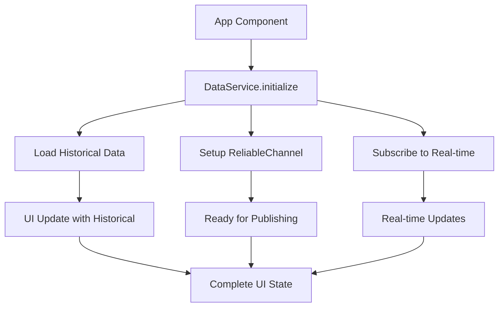

# Phase 4: DataService Integration - Complete Implementation Guide

## 📋 Overview

Phase 4 focuses on implementing the unified **DataService** that orchestrates all Waku protocols and provides a clean API for the application. This service acts as the integration layer between the ReliableChannelService, StoreService, and the UI components.

This phase transforms the foundation services (Phase 2) and protocol implementations (Phase 3) into a unified, developer-friendly interface that handles:
- **Data publishing**: Polls and votes via ReliableChannel
- **Real-time subscriptions**: Live data with automatic buffering
- **Historical data**: Store protocol with graceful fallback
- **Data validation**: Centralized validation and error handling

---

## 🏗️ DataService Architecture

### Unified Data Layer
```
┌─────────────────────────────────────────────────────────────┐
│                       DataService                           │
│  ┌─────────────────┐ ┌─────────────────┐ ┌─────────────────┐ │
│  │ ReliableChannel │ │  StoreService   │ │ IdentityService │ │
│  │   (Real-time)   │ │  (Historical)   │ │  (Validation)   │ │
│  └─────────────────┘ └─────────────────┘ └─────────────────┘ │
└─────────────────────────────────────────────────────────────┘
                              ↓
┌─────────────────────────────────────────────────────────────┐
│                    React Components                         │
│  ┌─────────────┐ ┌─────────────┐ ┌─────────────┐           │
│  │ PollCreation│ │   PollList  │ │VoteInterface│           │
│  └─────────────┘ └─────────────┘ └─────────────┘           │
└─────────────────────────────────────────────────────────────┘
```

**Key Benefits:**
- **Single API**: One service for all Waku operations
- **Automatic buffering**: ReliableChannel handles early data
- **Graceful degradation**: Store failures don't break the app
- **Type safety**: Strongly typed interfaces throughout

---

## 🔧 DataService Implementation

### File: `src/services/DataService.ts`

#### Core Structure

```typescript
import { LightNode } from '@waku/sdk';
import { ReliableChannelService } from './protocols/ReliableChannelService';
import { StoreService } from './protocols/StoreService';
import { IdentityService } from './IdentityService';
import { IPollData, IVoteData } from './ProtobufSchemas';
import { DataValidator } from './validators/DataValidator';
import { WakuConfig } from './config/WakuConfig';
import type { PollCallback, VoteCallback, ErrorCallback } from './channels/DataProcessor';

export interface DataServiceState {
  polls: IPollData[];
  votes: IVoteData[];
  loading: boolean;
  error: string | null;
  storeAvailable: boolean;
  isReady: boolean;
}

export class DataService {
  private reliableChannelService: ReliableChannelService;
  private storeService: StoreService;
  private identityService: IdentityService;
  private isInitialized = false;

  constructor(node: LightNode) {
    this.reliableChannelService = new ReliableChannelService(node);
    this.storeService = new StoreService(node);
    this.identityService = new IdentityService();
  }
}
```

#### Initialization with Unified Data Loading

```typescript
async initialize(): Promise<{ polls: IPollData[], votes: IVoteData[] }> {
  if (this.isInitialized) {
    console.log('📋 DataService already initialized');
    return { polls: [], votes: [] };
  }

  try {
    console.log('🚀 Initializing DataService...');

    // Step 1: Load historical data (graceful fallback if unavailable)
    const [historicalPolls, historicalVotes] = await Promise.all([
      this.loadHistoricalPolls(),
      this.loadHistoricalVotes()
    ]);

    console.log(`📊 Loaded ${historicalPolls.length} historical polls and ${historicalVotes.length} historical votes`);

    // Step 2: Initialize ReliableChannel for real-time data
    await this.reliableChannelService.initialize();
    console.log('✅ ReliableChannel initialized for real-time data');

    // Step 3: Mark as ready and flush any buffered data
    this.reliableChannelService.setReady(true);

    this.isInitialized = true;
    console.log('🎉 DataService fully initialized');

    return {
      polls: historicalPolls,
      votes: historicalVotes
    };

  } catch (error) {
    console.error('❌ DataService initialization failed:', error);
    throw new Error(`DataService initialization failed: ${error instanceof Error ? error.message : 'Unknown error'}`);
  }
}
```

#### Poll Publishing with Validation

```typescript
async publishPoll(pollData: Partial<IPollData>): Promise<void> {
  try {
    // Step 1: Validate user identity
    const identity = this.identityService.getIdentity();
    if (!identity) {
      throw new Error('Identity not available for poll creation');
    }

    // Step 2: Create complete poll data with defaults
    const completePoll: IPollData = {
      id: pollData.id || crypto.randomUUID(),
      question: pollData.question || '',
      options: pollData.options || [],
      createdBy: identity.publicKeyHex,
      timestamp: Date.now(),
      ...pollData
    };

    // Step 3: Validate poll data
    if (!DataValidator.validatePoll(completePoll)) {
      throw new Error('Invalid poll data provided');
    }

    // Step 4: Publish via ReliableChannel
    await this.reliableChannelService.publishPoll(completePoll);
    console.log('✅ Poll published successfully:', completePoll.id);

  } catch (error) {
    console.error('❌ Failed to publish poll:', error);
    throw error;
  }
}
```

#### Vote Submission with Identity Verification

```typescript
async submitVote(voteData: Partial<IVoteData>): Promise<void> {
  try {
    // Step 1: Validate user identity
    const identity = this.identityService.getIdentity();
    if (!identity) {
      throw new Error('Identity not available for voting');
    }

    // Step 2: Create complete vote data
    const completeVote: IVoteData = {
      id: voteData.id || crypto.randomUUID(),
      pollId: voteData.pollId || '',
      optionIndex: voteData.optionIndex ?? -1,
      voterPublicKey: identity.publicKeyHex,
      timestamp: Date.now(),
      ...voteData
    };

    // Step 3: Validate vote data
    if (!DataValidator.validateVote(completeVote)) {
      throw new Error('Invalid vote data provided');
    }

    // Step 4: Submit via ReliableChannel
    await this.reliableChannelService.publishVote(completeVote);
    console.log('✅ Vote submitted successfully for poll:', completeVote.pollId);

  } catch (error) {
    console.error('❌ Failed to submit vote:', error);
    throw error;
  }
}
```

#### Real-time Subscriptions

```typescript
async subscribeToPolls(callback: PollCallback): Promise<void> {
  try {
    await this.reliableChannelService.subscribeToPolls(callback);
    console.log('📡 Subscribed to real-time polls');
  } catch (error) {
    console.error('❌ Failed to subscribe to polls:', error);
    throw error;
  }
}

async subscribeToVotes(callback: VoteCallback): Promise<void> {
  try {
    await this.reliableChannelService.subscribeToVotes(callback);
    console.log('📡 Subscribed to real-time votes');
  } catch (error) {
    console.error('❌ Failed to subscribe to votes:', error);
    throw error;
  }
}

onError(callback: ErrorCallback): void {
  this.reliableChannelService.onError(callback);
}
```

#### Historical Data Loading with Graceful Fallback

```typescript
private async loadHistoricalPolls(): Promise<IPollData[]> {
  try {
    const polls = await this.storeService.loadHistoricalPolls();
    console.log(`📚 Loaded ${polls.length} historical polls from Store`);
    return polls;
  } catch (error) {
    console.warn('⚠️ Store protocol unavailable for polls - continuing with real-time only:', error.message);
    return [];
  }
}

private async loadHistoricalVotes(): Promise<IVoteData[]> {
  try {
    const votes = await this.storeService.loadHistoricalVotes();
    console.log(`📚 Loaded ${votes.length} historical votes from Store`);
    return votes;
  } catch (error) {
    console.warn('⚠️ Store protocol unavailable for votes - continuing with real-time only:', error.message);
    return [];
  }
}
```

#### Cleanup and Resource Management

```typescript
async cleanup(): Promise<void> {
  try {
    console.log('🧹 Cleaning up DataService...');

    if (this.reliableChannelService) {
      await this.reliableChannelService.cleanup();
    }

    this.isInitialized = false;
    console.log('✅ DataService cleanup completed');
  } catch (error) {
    console.error('❌ Error during DataService cleanup:', error);
  }
}

// Utility method to check if service is ready
isServiceReady(): boolean {
  return this.isInitialized && this.reliableChannelService.isReady();
}

// Get current identity
getCurrentIdentity() {
  return this.identityService.getIdentity();
}

// Check if Store protocol is available
isStoreAvailable(): boolean {
  return this.storeService.isAvailable();
}
```

---

## 🎨 App Component Integration

### File: `src/App.tsx`

#### Enhanced App Component with DataService

```typescript
import React, { useState, useEffect } from 'react';
import { WakuService } from './services/WakuService';
import { DataService } from './services/DataService';
import { IdentityService } from './services/IdentityService';
import { IPollData, IVoteData } from './services/ProtobufSchemas';
import type { Identity } from './services/IdentityService';
import ConnectionStatus from './components/ConnectionStatus';
import PollCreation from './components/PollCreation';
import PollList from './components/PollList';
import './App.css';

interface AppState {
  // Service states
  wakuStatus: WakuStatus;
  identity: Identity | null;
  dataService: DataService | null;

  // Data states
  polls: IPollData[];
  votes: IVoteData[];

  // UI states
  isInitializing: boolean;
  error: string | null;
  storeAvailable: boolean;
}

export default function App() {
  const [state, setState] = useState<AppState>({
    wakuStatus: {
      connected: false,
      peerCount: 0,
      syncComplete: false,
      error: null
    },
    identity: null,
    dataService: null,
    polls: [],
    votes: [],
    isInitializing: true,
    error: null,
    storeAvailable: true
  });

  useEffect(() => {
    const initializeApp = async () => {
      try {
        console.log('🚀 Initializing DecenVote App...');

        // Step 1: Initialize Identity
        const identityService = new IdentityService();
        const userIdentity = identityService.getIdentity();
        console.log('👤 Identity ready:', userIdentity.publicKeyHex.substring(0, 16) + '...');

        // Step 2: Initialize Waku
        const wakuService = new WakuService();
        const node = await wakuService.initialize();
        console.log('🌐 Waku node ready');

        // Step 3: Initialize DataService
        const dataService = new DataService(node);
        const initialData = await dataService.initialize();

        // Step 4: Setup real-time callbacks
        await dataService.subscribeToPolls((newPoll: IPollData) => {
          setState(prev => ({
            ...prev,
            polls: deduplicatePolls([...prev.polls, newPoll])
          }));
          console.log('📥 New poll received:', newPoll.id);
        });

        await dataService.subscribeToVotes((newVote: IVoteData) => {
          setState(prev => ({
            ...prev,
            votes: deduplicateVotes([...prev.votes, newVote])
          }));
          console.log('🗳️ New vote received for poll:', newVote.pollId);
        });

        dataService.onError((error: Error) => {
          console.error('❌ DataService error:', error);
          setState(prev => ({
            ...prev,
            error: error.message
          }));
        });

        // Step 5: Update state
        setState(prev => ({
          ...prev,
          identity: userIdentity,
          dataService: dataService,
          wakuStatus: wakuService.getStatus(),
          polls: initialData.polls,
          votes: initialData.votes,
          isInitializing: false,
          storeAvailable: dataService.isStoreAvailable()
        }));

        console.log('🎉 App initialization complete!');

      } catch (error) {
        console.error('❌ App initialization failed:', error);
        setState(prev => ({
          ...prev,
          error: error instanceof Error ? error.message : 'Initialization failed',
          isInitializing: false
        }));
      }
    };

    initializeApp();

    // Cleanup on unmount
    return () => {
      if (state.dataService) {
        state.dataService.cleanup();
      }
    };
  }, []);

  // Helper functions for deduplication
  const deduplicatePolls = (polls: IPollData[]): IPollData[] => {
    const pollMap = new Map<string, IPollData>();
    polls.forEach(poll => {
      const existing = pollMap.get(poll.id);
      if (!existing || poll.timestamp > existing.timestamp) {
        pollMap.set(poll.id, poll);
      }
    });
    return Array.from(pollMap.values()).sort((a, b) => b.timestamp - a.timestamp);
  };

  const deduplicateVotes = (votes: IVoteData[]): IVoteData[] => {
    const voteMap = new Map<string, IVoteData>();
    votes
      .sort((a, b) => a.timestamp - b.timestamp)
      .forEach(vote => {
        const key = `${vote.pollId}_${vote.voterPublicKey}`;
        if (!voteMap.has(key)) {
          voteMap.set(key, vote);
        }
      });
    return Array.from(voteMap.values());
  };

  if (state.isInitializing) {
    return (
      <div className="app-loading">
        <div className="loading-spinner"></div>
        <h2>Initializing DecenVote...</h2>
        <p>Connecting to Waku network and loading data...</p>
      </div>
    );
  }

  if (state.error) {
    return (
      <div className="app-error">
        <h2>❌ Initialization Error</h2>
        <p>{state.error}</p>
        <button onClick={() => window.location.reload()}>
          Retry
        </button>
      </div>
    );
  }

  return (
    <div className="App">
      <header className="app-header">
        <h1>🗳️ DecenVote</h1>
        <p>Decentralized Voting with Waku</p>
        <ConnectionStatus
          status={state.wakuStatus}
          identity={state.identity}
          storeAvailable={state.storeAvailable}
        />
      </header>

      <main className="app-main">
        <div className="app-section">
          <PollCreation
            dataService={state.dataService}
            identity={state.identity}
          />
        </div>

        <div className="app-section">
          <PollList
            polls={state.polls}
            votes={state.votes}
            dataService={state.dataService}
            identity={state.identity}
          />
        </div>
      </main>

      <footer className="app-footer">
        <p>
          📊 {state.polls.length} polls • 🗳️ {state.votes.length} votes
          {!state.storeAvailable && ' • ⚠️ Real-time only (Store unavailable)'}
        </p>
      </footer>
    </div>
  );
}
```

---

## 🔄 Integration Patterns

### 1. Service Communication Flow



### 2. Data Flow Architecture

```typescript
// Publishing flow
User Input → DataService.publishPoll() → ReliableChannelService → Waku Network

// Receiving flow
Waku Network → ReliableChannelService → DataProcessor → App State → UI Update

// Historical flow
App Start → DataService.initialize() → StoreService → Historical Data → Initial State
```

### 3. Error Handling Strategy

```typescript
export class DataServiceError extends Error {
  constructor(
    message: string,
    public readonly operation: string,
    public readonly recoverable: boolean = true
  ) {
    super(message);
    this.name = 'DataServiceError';
  }
}

// Usage in DataService
try {
  await this.reliableChannelService.publishPoll(poll);
} catch (error) {
  if (error.message.includes('Store protocol unavailable')) {
    // Recoverable - continue with real-time only
    console.warn('Store unavailable, continuing with real-time');
    return;
  }
  // Non-recoverable error
  throw new DataServiceError(
    'Failed to publish poll',
    'publishPoll',
    false
  );
}
```

---

## 📊 Success Metrics

### Expected Console Logs

```
🚀 Initializing DecenVote App...
👤 Identity ready: a1b2c3d4e5f6...
🌐 Waku node ready
🚀 Initializing DataService...
📚 Loaded 5 historical polls from Store
📚 Loaded 12 historical votes from Store
✅ ReliableChannel initialized for real-time data
📡 Subscribed to real-time polls
📡 Subscribed to real-time votes
🎉 DataService fully initialized
🎉 App initialization complete!
```

### Functional Indicators

✅ **DataService Integration**:
- Single API for all Waku operations
- Automatic buffering of early-arriving data
- Graceful Store protocol fallback
- Type-safe interfaces throughout

✅ **Real-time Synchronization**:
- Historical data loaded on startup
- Real-time updates via ReliableChannel
- Automatic deduplication of polls and votes
- Responsive UI state updates

✅ **Error Handling**:
- Graceful degradation for Store failures
- Clear error messages in UI
- Recovery mechanisms for network issues
- Proper cleanup on component unmount

---

## 🚀 Preparation for Phase 5

Phase 4 establishes the complete data layer foundation:

### Available Infrastructure:
- **DataService**: Unified API for all operations
- **Real-time subscriptions**: Automatic data synchronization
- **Historical data**: Store protocol with graceful fallback
- **Identity integration**: Ready for poll creation and voting
- **Error handling**: Robust error recovery patterns

### Ready for Phase 5:
- **Component implementation**: PollCreation, PollList, ConnectionStatus
- **Custom hooks**: usePolls, useVotes, useIdentity
- **State management**: React state with real-time updates
- **UI interactions**: Form handling and user feedback

The DataService provides everything needed to build responsive, real-time UI components that seamlessly integrate with the Waku network while maintaining excellent user experience even when network conditions are challenging.

---

## 💡 Conclusion

Phase 4 creates a **production-ready data layer** that:

- **Unifies all Waku protocols** behind a single, clean API
- **Handles complexity internally** while exposing simple methods
- **Provides automatic buffering** for reliable data handling
- **Gracefully degrades** when Store protocol is unavailable
- **Maintains type safety** throughout the data flow

The DataService acts as the **perfect bridge** between the complex Waku protocols and the React application, enabling developers to focus on building great user experiences rather than managing protocol details.